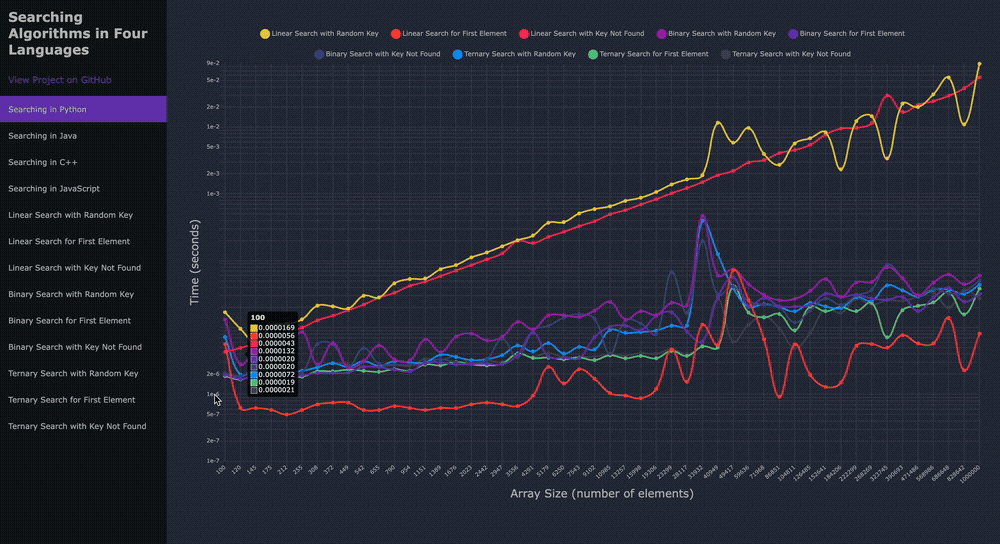
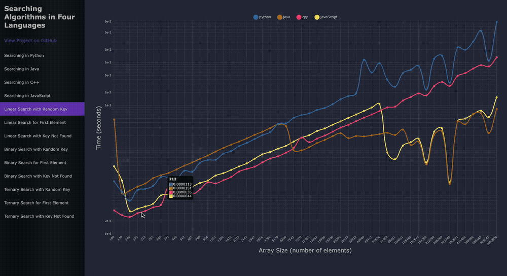

# Searching Algorithms in Four Languages
Comparing the efficiencies of searching algorithms implemented 
in four programming languages: Python, Java, C++, and JavaScript.

Results: https://jonperk318.github.io/searching-algorithms/

## How to Use
Languages and packages used:
* Python 3.12.2
* Java 21.0.1
* C++ Apple Clang 15.0.0 (clang-1500.3.9.4)
* JavaScript Node 20.15.0
* * webpack-cli 5.1.4

First, run `./samples/sample_generator.py` to generate 50 sample arrays of logarithmically-spaced sizes from
100 to 1,000,000, each containing randomly-generated integers ranging from 1 to 1,000,000. These arrays are outputted 
into text files along with `./samples/sample-sizes.txt`, which contains the array sizes.

Second, run the following four main functions each utilizing three searching algorithms (with three trials each) 
implemented in their respective languages:
* `./python-algorithms/main.py`
* `./java-algorithms/src/Main.java`
* `./cpp-algorithms/main.cpp`
* `./javascript-algorithms/main.js`

These each generate text files containing the searching times for each algorithm.

Third, run `./src/result-loader.js` to convert these results into `./dist/results.js`, using a format readable by 
`./dist/main.js`. To generate this file, run `npx webpack` in the root directory.

## Results

The first four sections show all searching algorithms in one of four languages. The y-axis 
of each graph is scaled logarithmically.

In Python, Java, and JavaScript, linear search with a random key and with the key not found performed similarly, 
and both were the slowest. Linear search performs better than the other algorithms when the key was the first element 
in the array, while binary search and ternary search performed similarly whether the key was the first element, random
integer potentially present in the array, or an integer not present.

Python and C++ were the slowest languages, while Java and JavaScript performed the best.

JavaScript had the fastest times for larger arrays on all algorithms except for merge sort, 
and Java came in second on several others. It is unclear why C++ performed so poorly compared to the other languages 
which are less optimized for speed, but perhaps this is a memory allocation issue. The issue will be further explored 
to provide more accurate results.

## Sources

This project was inspired by:
* The searching algorithms demonstrated in multiple languages on GeeksforGeeks:
  https://www.geeksforgeeks.org/searching-algorithms/
* A sorting benchmark project by Ilya Frolov:
  https://github.com/frolovilya/sorting-benchmark/